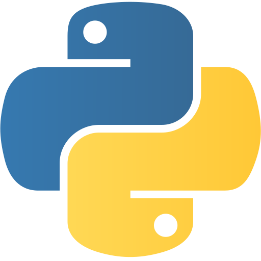
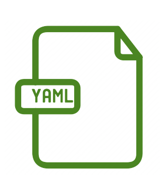
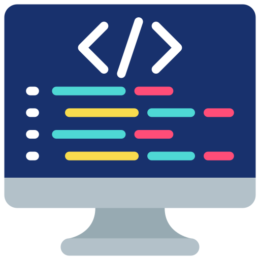

# Welcome🙌

This workshop series is geared toward R and SAS users who are interested in exploring Python–a powerful, versatile programming language that excels in many areas such as machine learning, large-scale data processing, and broader data science applications.

Our goal is to help you build a solid foundation in Python and gain skills that can be integrated into your own work. This series will guide you through reproducible workflow using Python virtual environments, understanding basic Python data structures, data manipulation through `pandas`, and, finally, applying machine learning and deep learning methods using libraries such as `scikit-learn` and `PyTorch`.

All workshop materials, including pre-session handouts, coding demos, assignments, and session slides, will be uploaded here. Be sure to check out the [FAQ](https://pythonforrusers.github.io/Python-Workshop.github.io/FAQ.html) tab for common questions. If you have any questions, suggestions, or ideas for future sessions, please feel free to share them on our [GitHub Discussions](https://github.com/PythonForRUsers/Python-Workshop.github.io/discussions) page. We value your feedback and aim to continually improve the workshops. We look forward to learning with you!

# Workshop Information

**Time and Location:** Tuesdays (3/3, 3/10, 3/26, 3/31) | 3:00 – 4:30pm | 708 Broadway, Room 801

**Contact and Office Hours**:

-   Dani Vaithilingam ([vaithid1\@mskcc.org](mailto:vaithid1@mskcc.org){.email}): OH **TBD**
-   Patrick Augello ([augellp1\@mskcc.org](mailto:augellp1@mskcc.org){.email}): OH **TBD**
-   Yufei Deng ([dengy\@mskcc.org](mailto:dengy@mskcc.org){.email}): OH **TBD**

::: {tbl-colwidths="[20, 12, 42, 25]"}
+-----------------------------------------------------------------------+----------+----------------------------------------------------------------+------------------------------------------------------------------------------------------------------------------------------------+
| **Session**                                                           | **Date** | **Outline**                                                    | **Materials**                                                                                                                      |
+-----------------------------------------------------------------------+----------+----------------------------------------------------------------+------------------------------------------------------------------------------------------------------------------------------------+
| **Session 1:**                                                        | Tuesday  | Python, Positron IDE, GitHub, and virtual environment overview | Installation guide [html](session1/session1.html)                                                                                  |
|                                                                       | (3/3)    |                                                                |                                                                                                                                    |
| **Python Installation and Reproducible Workflow** (Yufei)             |          | -   Create a GitHub repository for the workshop series         | Session Slides [html](session1/session1-python-setup.html)                                                                         |
|                                                                       | 3-4:30 pm| -   Set up a `venv` virtual environment through command lines  |                                                                                                                                    |
|                                                                       |          | -   Navigate Positron to work on Python Projects               |                                                                                                                                    |
+-----------------------------------------------------------------------+----------+----------------------------------------------------------------+------------------------------------------------------------------------------------------------------------------------------------+
| **Session 2:**                                                        | Tuesday  | -   Data container types: Strings, lists, tuples, dicts, etc.  | Pre-reading [docx](https://github.com/PythonForRUsers/Python-Workshop.github.io/blob/main/Downloadable/Python_Prereading_23.docx)  |
|                                                                       | (3/10)   | -   Handling missingness                                       |                                                                                                                                    |
| **Intro to Python Data Structures** (Patrick)                         |          | -   Methods vs. functions                                      | Session Slides [html](session2/DataStructuresDemo.html)                                                                            |
|                                                                       | 3-4:30 pm|                                                                |                                                                                                                                    |
+-----------------------------------------------------------------------+----------+----------------------------------------------------------------+------------------------------------------------------------------------------------------------------------------------------------+
| **Session 3:**                                                        | Thusday  | -   `pandas` for data manipulation and cleaning                | Session Slides [html](session3/DataStructuresDemo_2.html)                                                                          |
|                                                                       | (3/26)   | -   Data management                                            |                                                                                                                                    |
| **Intro to Pandas** (Patrick)                                         |          | -   `great_tables` for gtsummary-style tables                  |                                                                                                                                    |
|                                                                       | 3-4:30 pm|                                                                |                                                                                                                                    |
+-----------------------------------------------------------------------+----------+----------------------------------------------------------------+------------------------------------------------------------------------------------------------------------------------------------+
| **Session 4:**                                                        | Tuesday  | **Part A:** Introduction to object-oriented programming (OOP)  | Pre-read: [PyTorch and Plotting Primer](session4/sess4preread.html)                                                                |
|                                                                       | (3/31)   |                                                                |                                                                                                                                    |
| **Object-Oriented Programming & Intro to ML Libraries** (Dani)        |          | -   Recap: classes, methods, and attributes                    | Session Slides [html](session4/session4v3_slides_sc.html)                                                                           |
|                                                                       | 3-4:30 pm|                                                                |                                                                                                                                    |
|                                                                       |          | -   Understanding classes (base, derived, mixins)              |                                                                                                                                    |
|                                                                       |          |                                                                |                                                                                                                                    |
|                                                                       |          | -   Creating classes and instances                             |                                                                                                                                    |
|                                                                       |          |                                                                |                                                                                                                                    |
|                                                                       |          | -   Understanding inheritance                                  |                                                                                                                                    |
|                                                                       |          |                                                                |                                                                                                                                    |
|                                                                       |          | **Part B:** `PyTorch` for machine learning                     |                                                                                                                                    |
|                                                                       |          |                                                                |                                                                                                                                    |
|                                                                       |          | -   Building Neural Network with Pytorch                       |                                                                                                                                    |
|                                                                       |          |                                                                |                                                                                                                                    |
|                                                                       |          | -   Plotting with Python (`plotnine`, `seaborn`)               |                                                                                                                                    |
+-----------------------------------------------------------------------+----------+----------------------------------------------------------------+------------------------------------------------------------------------------------------------------------------------------------+
:::

# Other Resources

## 🔗Quick Installation & Downloads
<!-- #### Tutorials and Handouts

-   <a href="session1/session1.html">Session 1 Tutorial: Installing Python and Essential Tools</a>

-   <a href="session2/DataStructuresDemo.html">Session 2: Intro to Python Data Structures </a>

-   <a href="session3/DataStructuresDemo_2.html">Session 3: Intro to Pandas </a>

-   <a href="session4/session4v3_webpage.html">Session 4: Object-Oriented Programming and Intro to ML Libraries - Extended tutorial</a> -->

<a href="https://www.python.org/downloads/" class = "link-block">
    
    
Install Python (❗recommend 3.10+)

<a href="https://positron.posit.co/" class = "link-block"> 
    
    
Install Positron

<!-- <a href="https://www.anaconda.com/docs/getting-started/miniconda/main" class="link-block"> 

Install Miniconda
 -->

<a href="https://github.com/PythonForRUsers/Python-Workshop.github.io/blob/main/Downloadable/requirements.txt" class="link-block">
    
    
Download requirements.txt file 

</a>

 <a href="https://github.com/PythonForRUsers/Python-Workshop.github.io/tree/main/FollowAlong" class="link-block">
    
    
Download Follow Along File

</a>

 <a href="https://www.kaggle.com/datasets/erdemtaha/cancer-data" class="link-block">
    
    
Download Toy Dataset

</a>

## Useful External Tutorials

-   <a href="https://wesmckinney.com/book/">Python for Data Analysis, 3rd Edition, by Wes McKinnery</a>

-   <a href="https://packaging.python.org/en/latest/guides/installing-using-pip-and-virtual-environments/#create-and-use-virtual-environments">Create and use virtual environments with **venv**</a>

-   <a href="https://realpython.com/python3-object-oriented-programming/">Object-Oriented Programming (OOP) in Python</a>