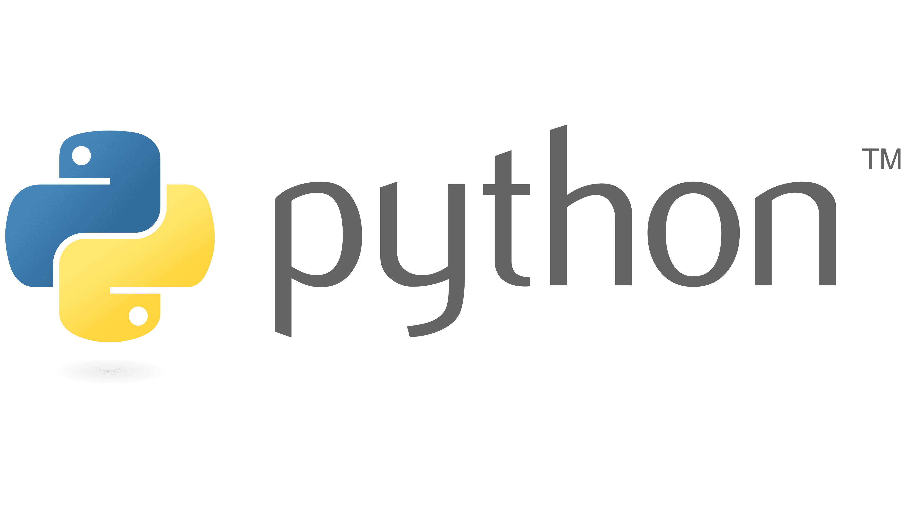
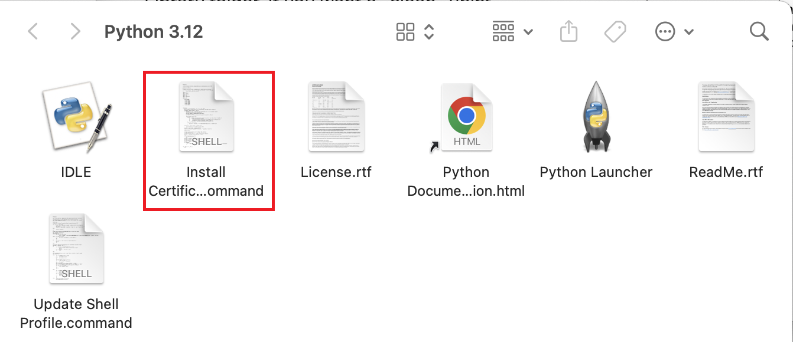
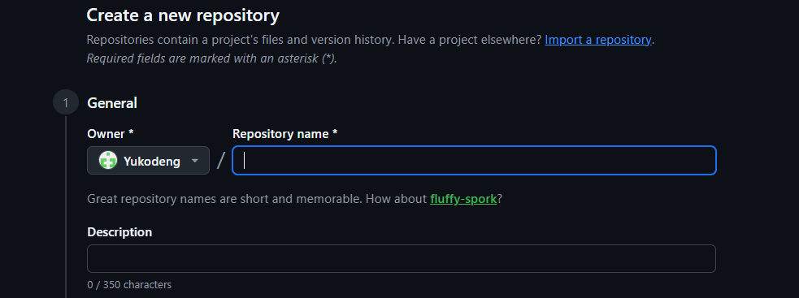
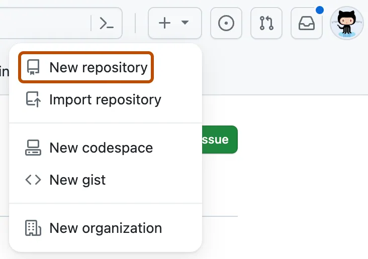
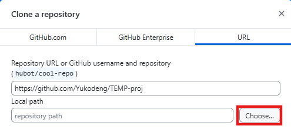
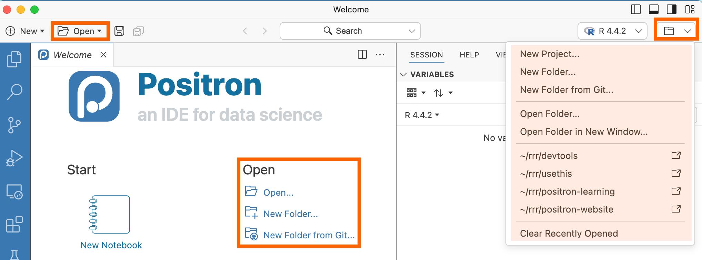
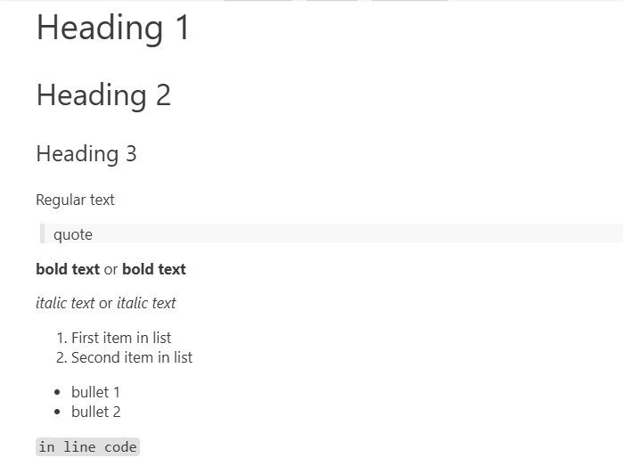
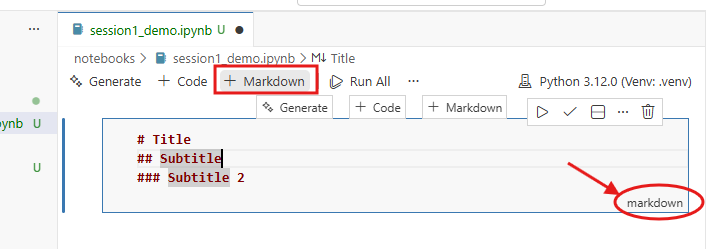

## 🔎Workshop at a Glance:

The overall **goal** of the Workshop is to learn how to program in Python using modern, reproducible tools.

-   **Session 1** will introduce the essential tools for Python programming and reproducible workflow.

-   **Session 2** will focus on the fundamentals of Python coding, including data structure, syntax, list comprehensive, and functions.

-   **Session 3** will extend session 2 and showcase the basics of data wrangling and manipulation with the `pandas` library.

-   **Session 4** will introduce you to object-oriented programming (OOP) with example machine learning applications with the `scikit-learn` and `pytorch` libraries.
 

## ❗What to Prepare for the Workshop

-   Bring your **laptop (Windows/macOS)**

-   Install [Python](https://www.python.org/downloads/) and the [Positron IDE](https://positron.posit.co/download.html)

-   Create a GitHub account & [download GitHub Desktop](https://desktop.github.com/download/)

::: callout-important
The `PyTorch` package requires ***Python 3.10+***. 

If unsure about the version, we recommend installing **Python 3.12** as it is the most current secure and stable release.
:::

## 📖 About this Guide

This tutorial page accompanies the first session of the Introduction to Python workshop. It serves as a introduction to the Python coding ecosystem and a follow-along guide to help you set up the essential tools like Positron, virtual environment, as a preparation for the upcoming sessions.

In the first part of the giude, we will start with some key questions–***What is the difference between coding in R vs. Python? How can we, as biostatisticians, apply it to our work?*** You will get an overview of the key features of Python, how it compares to R, and what packages are available for biostatistics/bioinformatics research. 

In the second part, we will take the first step toward coding in Python. We will follow step-by-step guides to install Python to the computer, create virtual environments with `venv`, and set up a GitHub project using Jupyter notebook in the Positron IDE. 

After this tutorial, you will be prepared for building reproducible Python data science projects.

::: {.callout-tip icon="false"}
## 📝Learning objectives of the guide

**💡Aim 1**: know key features of Python and its applications.

**💡Aim 2**: know what virtual environments are and how to create them with `venv`.

**💡Aim 3**: know key features of Jupyter notebook and the integrated development environment (IDE) Positron. 

**💡Aim 4**: know steps of building reproducible Python project with `venv` in Positron.
:::

# 1. Introduction to Python

## What is Python?

{width="220"}

> Python is a **high-level**, **interpreted**, and **general-purpose programming language** first developed by Guido van Rossum in 1991.

Python has gained much popularity in the past 20 years.
Its user group has expanded into a large and active scientific computing and developer community that spans numerous academic and industrial fields.
Nowadays, Python has a powerful ecosystem of [external packages (libraries)](https://pypi.org/) for data science, artificial intelligence, and software development.

Python is cross-platform and open-source.
In Python, you can easily install packages with the built-in installer `pip` or package manager `conda`, just as you do with `install.packages()` in R.

## What can Python do?

Just like R, Python is an open source and versatile programming language that allows users to perform a wide range of data analysis and computational tasks.
While R is particularly useful in statistical analysis and visualizations, Python has been used in many distinct areas, such as:

-   Machine Learning and Deep learning
-   Web Development
-   Scripting & Automation
-   Cloud Computing
-   Game Development
-   Cybersecurity

## Why learn Python–as Biostatisticians?

Within the field of biostatistics/ bioinformatics, Python has become a core tool for biomedical data analysis due to its versatility, reproducibility, and strong ecosystem of scientific libraries.
Below are some areas where Python can be useful and some essential libraries.

-   **Statistical analysis**

    While R is the go-to tool for statistical analysis, Python has caught up with many equivalent libraries and functions:

    -   `statsmodels`/ `scipy.stats` provide **regression modeling** and **hypothesis testing**.
    -   `lifelines`/ `scikit-survival` support **survival analysis** and plotting.
    -   `polars` (~`dplyr` data cleaning) / `great_tables` (~`gt` tables) / `plotnine` (~`ggplot2` visualizations)

-   **ML/DL ecosystem**

    Python dominates in machine learning and AI development:

    -   `scikit-learn` is a rich **machine learning** library that supports both supervised regression an dclassification (e.g., random forests, gradient boosting) and unsupervised clustering (e.g., K-means).
    -   `TensorFlow`, `PyTorch` are **deep learning** libraries widely used for computer vision and natural language processing.
    -   `optuna`, `Ray` can be integrated into ML/DL workflows for easy and efficient **model training, hyperparameter tuning, fine-tuning**, etc.

-   **Omics data analysis**

    Emerging packages that provide standard omics data preprocessing and analysis pipelines allow Python to become increasingly popular in the field of bioinformatics:

    -   `scanpy`, `anndata` are libraries for single-cell RNA-seq data loading, preprocessing, and analysis.
    -   `Biopython` is a set of tools for biological computation that performs file parsering (BLAST, FASTA, GenBank, etc.), sequence analysis, clustering algorithms, etc.
    -   `pysam` works with BAM/SAM/VCF files.

## Python vs. R: Differences

While both programming languages are popular for data analysis and computation, Python and R differ in their underlying code structure, the scope of functionality, and the extensibility of tasks they can perform. While R is developed by statisticians mainly for data analysis, Python is a general programming language developed by computer scientists for much more general purposes.

Here is a non-exhaustive summary of some key differences:

::: {tbl-colwidths="[15, 30, 30]"}
| **Feature/Task** | **R** | **Python** |
|-------------------|-------------------------|----------------------------|
| **General-purpose** | ⚠️ Less ideal – designed for data analysis | ✅ Strong – data science, ML/AI, software development, scripting, etc. |
| **Programming logic** | Function-oriented - *everything* is a "function" | Object-oriented – structured around **classes** |
| **Computational power** | ✅ Vectorization allows operating on all elements of a vector at once <br> ✅ Best for statistical analysis <br> ⚠️ Memory-intensive; often slow for reading large data and performing large computations | ✅ Generally faster for loops <br> ✅ Strong support for GPU computing <br> ✅ Memory-efficient for handling large objects and complex computations |
| **Package availability** | ✅ Excellent for statistical analysis (glm, survival, ggplot2) <br> ⚠️ Good options for ML (caret, mlr3) but few DL packages <br> ✅ Great for omics-focused analysis (Bioconductor, ComplexHeatmap, Seurat) | ☑️ Improving on statistical packages (statsmodels, lifelines) <br> ✅ Best for ML/DL (scikit-learn, pytorch, keras) <br> ✅ Established packages specialized in processing large omics datasets (scanpy, scvi-tools) |
| **IDE & Tools** | ✅ RStudio <br> ✅ RMarkdown, Quarto | ✅ Visual Studio Code, JupyterLab, PyCharm, Spyder, etc. <br> ✅ Jupyter Notebooks, Quarto |
:::


## Essential Tools for Python Programming

To get the most out of Python–-especially for data science –it's important to set up an integrated, flexible, and **reproducible programming environment**.

Here is a list of tools we recommend using:

-   **pip**: an installer for Python packages that comes with modern versions of Python installation.
-   **Positron**: a code editor for both R and Python coding that integrates features from Rstudio + VS Code.
-   **Jupyter Notebook**: an interactive computing tool that combines code execution, text documentation, and visualizations.
-   **Git/GitHub**: version control, collaboration, and code sharing.


#### **Pip**

Pip is a popular tool for installing and managing Python packages. It accompanies Python installations by default since Python 3.4+.

Pip provides a **command-line interface (CLI)** to intsall, upgrade, and uninstall packages from the Python Package Index (PyPI) and other sources like GitHub repositories. Pip can also be utilized for creating **virtual environments**--similar to `renv` in R but far more flexible, ensuring dependency isolation and project reproducibility. 


#### **Positron**

**Positron** is an open-source IDE for multi-language coding (Python, R, etc.) with numerous integrated data science and developer features, including:

- Multi-pane display: live coding + console + variables/help/plot panel
- Interactive coding via Jupyter Notebook and Quarto
- Support for remote hosts connection
- Built-in version control with Git/GitHub

#### **Jupyter Notebook**

**Jupyter Notebook** is a code editing application that offers interactive interface to edit code, visualize output, and include texts/graphics. It is a highly flexible tool for explorative analysis and presenting/sharing your code. As mentioned above, it is integrated into IDEs such as Positron, where you can deploy the feature by creating files with the Notebook extension, `.ipynb`.

#### **Git/GitHub**

**Git** is a version control system that tracks **local** changes in files. It is particularly useful when you collaborate with others on the same files at the same time.

**GitHub** is a cloud-based platform built on Git, where you can store, share, and collaborate with others on your work. Specifically, GitHub allows you to: 

- **Track and commit changes** to files in a repository
- **Revert or compare** previous versions when something breaks
- **Branching** allows teamwork in parallel without overwriting each other’s work
- **Backup** your research projects in a centralized location
- **Sharing** code for publication purposes 


# 2. Python Installation

In this guide, we will install Python through the official python.org website. This is a lightweight, straightforward method that applies to all computer operating systems (OS). However, there are many existing package management software tools that support Python installation:

| Installer | Windows | macOS |
|------------------------------------------|------------|------|
| **[Miniconda / Anaconda](https://www.anaconda.com/)** | ✅ | ✅ |
| **[Homebrew](https://brew.sh/)**       | ✅ | ❌ |
| **[Pixi](https://pixi.prefix.dev/latest/)**| ✅ | ✅ |
| **[uv](https://docs.astral.sh/uv/)**   | ✅ | ✅ |

Each offers unique set of features, including but not limited to: 

* *multi-language package installation*
* *script execution*
* *virtual environment management*
* *package development*

Some, such as **Pixi** and **uv**, are very recent releases, yet proving to be powerful and flexible tools. Feel free to check out and explore the features. 


## ▶️Follow-Along: Install Python {#follow-along-install-python}

Let's walk through steps to install **Python**.

1.  Go to the official Python website: [python.org/downloads/](https://www.python.org/downloads/). Select your computer's OS (Windows/macOS) from the **Downloads** dropdown menu.

    💡Recommend **Python 3.12**, the most recent stable release.

2.  Download the **64-bit installer** for your desired Python version (*unless your Windows has 32-bit OS*).


3.  **Run the installer** (`.exe` for Windows / `.pkg` for macOS).

    **For Windows**, when the “Install Python” window appears: 

    - ☐ *Use admin privileges* **--Optional**
    - ✅ *Add python to PATH* **--Recommended**. It makes Python and pip work from any terminal without extra setup.
    
    - ✅Choose "Install Now" and keep the default installation location. E.g., `C:\Users\<user_name>\AppData\Local\Programs\Python\`

    **For macOS**, 
    
    -   Click through the installer prompts. It typically installs to fixed locations and enables `python` and `pip` (or `python3.x` and `pip3` for macOS) commands in terminal without needing to manually edit PATH.

    -   When finished, you will see the following shows up:

        {width="400"}

    -   Click on the `.command` file. This will open a temporary **Terminal** shell window. Ensure that you see `[Process completed]` before closing the window.

4.  **Check installation**. Verify in Terminal that Python is successfully installed.

    -   Open **Terminal** (or PowerShell / Command Prompt on Windows) and type the following command:

        For Windows:

        ``` bash
        python --version
        pip --version
        ```

        For macOS, you might need:

        ``` bash
        python3 --version
        pip3 --version
        ```

    -   You should see the version of your Python and pip returned. E.g., `Python 3.12.10` and `pip 25.0.1`--the exact numbers depend on specific versions installed.

    -   If Python is not found, it usually means PATH wasn't correctly updated or you have another Python version in PATH that interferes with the current installation.

***Now, you can start coding in Python in the terminal!***

Try it out by opening the **Python interactive shell** in the terminal by typing:

``` bash
python
```

And you will see something like:

``` python
Python 3.12.10 (tags/v3.12.10:0cc8128, Apr  8 2025, 12:21:36)
Type "help", "copyright", "credits" or "license" for more information.
>>>
```

Now, you can type Python commands directly. For example, importing a package: 

``` python
>>> import statistics
>>> data = [1, 2, 3, 4, 5]
>>> statistics.mean(data) # should return the mean 3
```

Exit the interactive console with: 

``` python
>>> quit() # or exit()
```


# 3. Virtual Environment & Package Management with Pip

## What is Pip?

**Pip** is the most widely used package installer and manager for Python (and Python-exclusive; see below on pip vs. Conda). You can use it to install packages from the default [PyPI](https://pypi.org/), an open-source repository of published software for Python users, as well as other indexes.

Pip provides a command-line interface to help install packages in the terminal. Pip comes bundled with Python installaitons by default in most modern Python releases since Python 3.4+. It works in multiple computer OS including Windows, macOS, and Linux.


## Pip for Managing Packages

Most Python packages are installed from **PyPI** using `pip install`:

``` bash
# Install a single package
pip install scipy

# Install a specific version of a package
pip install scipy==1.14.0 

# Install multiple packages
pip install scipy==1.14.0 pandas matplotlib
```

Sometimes a package is not available on PyPI, or if you want to install a package directly from **GitHub**:

``` bash
pip install git+https://github.com/pypa/sampleproject.git
# or a specific branch/commit:
pip install git+https://github.com/pypa/sampleproject.git@main
```

To **upgrade** a package:

``` bash
pip install --upgrade scipy
```

*Note that this automatically upgrades the package to the highest version available from the PyPI supported by the current Python series. For example, Python 3.12 updates to the highest available in the 3.x series.*

To **uninstall** a package (or multiple packages at once):

``` bash
pip uninstall scipy pandas matplotlib
```

#### **Pip vs. Conda**

**Pip** installs and manages Python packages from PyPI (and other Python package sources).

**Conda** is a broader tool for managing packages and environments that can handle both Python and non-Python dependencies (e.g., R packages, C++, system binaries, etc.). It comes with installers such as Miniconda or the Anaconda Distribution.

::: callout-note
## Difference Between conda and pip

They both share similar syntax (e.g., `conda install` and `pip install`) and can ***sometimes*** be used together; Although there are caveats--it is generally recommended that you only use `conda install` within a conda environment, as anything installed via pip won't be recognized by conda and vice versa. Using the two interchangeably might overwrite or break packages and mess up the environment.

**What if the Python package is unavailable through conda?**

The best practice is to ***install everything with conda first, then use pip only when the package is not available in conda.***

Check out this [blog](https://www.anaconda.com/blog/using-pip-in-a-conda-environment) for more information on using pip in a conda environment.
:::

## What is a Virtual Environment?

A **virtual environment** is an isolated, self-contained workspace that includes its own **Python interpreter** and **package dependencies**.
Each environment operates independently, ensuring that projects are isolated from one another and from the system’s global setup.

In the previous section, we installed Python 3.12 locally to our computer.

However, you might need a different Python version (e.g., Python 3.10) or a different set of packages for a particular project. In this case, creating a **virtual environment** allows you to maintain a completely separate Python setup, including its own Python version and the `/site-packages` folder.

You can create as many environments as needed—ideal for managing multiple projects with different requirements.

## Why Use Virtual Environments?

You may find the flexibility of environments beneficial in many cases.

-   **Avoid Conflicts.** Virtual environments help prevent potential conflicts between projects that require different package versions. Changes made to one environment won't affect other projects.
-   **Easy Management**. When you want to experiment without having to worry about breaking your global Python, work inside a virtual environment and delete it later if needed.
-   **Sharing Environment**. You can share your environment dependencies with others using a `requirements.txt` file.
-   **Reproducibility.** They work as time capsules, allowing you to return to an older project at any time later by recreating the environment.

## ▶️Follow-Along: Create a Virtual Environment with `venv`

Using `venv`, we can **create, activate, export,** and **remove** virtual environments.

Let's create a virtual environment and install packages into it using the `pip` command-line tool.

::: {.callout-important icon="false"}
## 📌Prerequisite

Be sure you have installed Python by following the previous [tutorial](#follow-along-install-miniconda-python-conda) so you have access to the `python` (or `py`) and `pip` commands.
:::

::: callout-tip
`conda` is an alternative to creating virtual environments across operating systems and programming languages.
However, for this workshop, we use pip + venv because it works out-of-the-box with standard Python installations.
:::

1.  Open Open **PowerShell / Command Prompt** (Windows) or **Terminal** (macOS/Linux)

2.  Navigate to your project folder (or create one):

    ``` bash
    cd /path/to/your/project
    ```

2.  Create the virtual environment. This creates a folder called `.venv` inside your project folder.

    ``` bash
    python -m venv .venv
    ```

    *Note: naming it .venv is a common convention and works well with IDE auto-detection. But you may replace it with the name you desire.*

3.  To create an environment with a specific Python version (*You will need the version installed to your computer*):

    ``` bash
    python3.10 -m venv .venv
    ```

    or on Windows:

    ``` bash
    py -3.10 -m venv .venv
    ```

4. To activate the environment in the terminal:

    ``` bash
    source .venv/bin/activate   # macOS/Linux
    .venv\Scripts\activate.bat  # Windows (Command Prompt)
    .venv\Scripts\Activate.ps1  # Windows (PowerShell)
    ```

    When activated, your terminal will show:

    ``` bash
    (.venv)
    ```

::: callout-warning
## Avoid installing packages into the wrong environment!

Always confirm your environment is activated (you should see (.venv) in your terminal prompt) before installing packages.
If you forget to activate, `pip install` will install into your global Python instead.
:::

5.  Verify that you are using the correct Python interpreter:

    ``` bash
    python --version
    ```

6.  To install package(s) inside the environment from PyPI:

    ``` bash
    pip install scipy pandas matplotlib
    ```

8.  Deactivate the environment:

    ``` bash
    deactivate
    ```

9.  Removing an environment:

    Since a venv is just a folder, you can delete it safely, either by deleting the `.venv/` folder or removing via terminal:

    ``` bash
    rm -rf .venv        # macOS/Linux
    rmdir /s /q .venv   # Windows
    ```

### 👉Create an Environment from a `requirements.txt` File {#create-env-txt-file}

1.  You can also use a `requirements.txt` file to install all dependencies to a virtual environment at once:

    ``` bash
    pip install -r requirements.txt
    ```

    Example `requirements.txt`:

    ``` text
    pandas
    numpy
    matplotlib
    scipy==1.14.0
    ```

    ::: callout-note
    Download the `requirements.txt` file for this Python workshop series [here](https://github.com/PythonForRUsers/Python-Workshop.github.io/blob/main/Downloadable/environment.txt). It includes the necessary packages for completing the Workshop sessions.
    :::

2.  To snapshot your current environment (exact installed versions):

    ``` bash
    pip freeze > requirements.txt
    ```

    Then you or others can later recreate the same environment with:

    ``` bash
    pip install -r requirements.txt
    ```

| Task                                      | Command                              |
| ----------------------------------------- | ------------------------------------ |
| Create an environment                     | `python -m venv .venv`               |
| Activate environment (Mac/Linux)          | `source .venv/bin/activate`          |
| Activate environment (Windows PowerShell) | `.venv\Scripts\Activate.ps1`         |
| Activate environment (Windows Command Prompt)| `.venv\Scripts\activate.bat`      |
| Deactivate environment                    | `deactivate`                         |
| Install packages                          | `pip install <package>`              |
| Install from requirements file            | `pip install -r requirements.txt`    |
| List installed packages                   | `pip list`                           |
| Snapshot exact versions                   | `pip freeze > requirements.txt`      |

: List of `pip + venv` commands for managing environments and dependencies.

# 4. Integrated Development Environment

An **Integrated Development Environment (IDE)** is a software application that brings together everything you need to write and run code and manage projects.

It typically includes:

-   A code editor
-   Terminal panel
-   A compiler or interpreter to execute code
-   Debugger and version control integration

For Python, there are many existing IDEs that offer great compatibility and multi-functionality.

| Tool | Description |
|---------------------------|---------------------------------------------|
| **Positron**   | Modern IDE for Python + R with strong Quarto and notebook support |
| **VS Code**    | Lightweight, powerful IDE (extensible with Python & Jupyter extensions) |
| **PyCharm**    | Full-featured Python IDE (more for software dev) |
| **Spyder**     | RStudio-like interface, good for scientific Python |
| **JupyterLab** | Interactive notebooks for analysis & reports |

We will use the **Positron** IDE for the workshop series.

## Positron

{width="100"}

> **Positron** is a modern IDE developed by Posit--the same developer as **RStudio**--and is built on **VS Code**'s open source code ([Code - OSS](https://github.com/Microsoft/vscode)). It inherited many great features from both RStudio and VS Code, making it a powerful tool for data science workflows across **Python and R**.

-   **Built-in Suuport for Python and R.** Positron inherits VS Code's support for multiple programming languages. But *unlike VS Code*, it treats R and Python as primary coding languages and provides out-of-the-box support for Python and R without the need to install any extensions. 

-   **RStudio-Style Layout.** Positron has a similar layout design as RStudio (Editor, Console, Plots/
Variables/Help panes), but with additional features like the file Explorer side bar, search button, Git source control, remote connection, etc., allowing for more data science specific functions. 

-   **Language Switch via Multi-Session Console.** Positron allows working in multiple console sessions with different languages/environments at the same time. You can run R or Python code line-by-line or in chunks interactively in each console, while quickly switching between for a seamless analytical workflow. 

-   **Integrated Git Control & Remote Connection.** Similar to VS Code, Positron integrates Git and remote connection. This allows version control of projects like tracking changes, managing branches, and resolving conflicts within the IDE. Positron also supports Remmote SSH connection to work on projects on the cluster.


# ▶️Follow-Along: First Python Project in Positron 

We’ll now walk through setting up your Python porject in Positron, using `venv` (covered about) as well as usefull tools like Git/GitHub and Jupyter Notebook:

* Create a **Git repository** for your project
* Open the project in Positron
* Set up virtual environment with `venv` 
* Create a **Jupyter notebook** (`.ipynb`) file

::: {.callout-important icon="false"}
## 💡Prerequisites

Ensure you have installed the following:

-   **Python (3.10+ recommended)**: [▶️Follow-Along: Install Python)](#follow-along-install-python)
-   **Positron**: [Download and install Positron](https://positron.posit.co/download.html)
-   **GitHub Desktop**: [Download GitHub Desktop](https://desktop.github.com/download/)
-   **(Optional) Git CLI**: [Install Git on your computer](https://git-scm.com/install/)
:::


### Step 1: Create a Git Repository

#### **Create on GitHub**

1.  Go to [GitHub](https://github.com). **Sign in** or **create and account** if you haven't done so.

2.  Create a new repository.

    -   In the upper corner of the GitHub webpage, select `+`, and click **New repository**.
    
    -   Type a name in the **"Repository name"** box (e.g., **`workshop-project`**). Optionally add a short description in the **"Description"** box.

        {width="600"}

    -   Add a `README.md` file for a longer description of that will be displayed on the repository `<>Code` page.

    -   Add a `.gitignore` file (choose **Python**) to tell Git which files/folders to ignore when making commits. E.g., the Python template by defualt ignores environment files `.venv`/`.env`/etc.

        {width="600"}

    -   Click **"Create repository"**


3.  Clone repository to your local computer by clicking {.absolute top=0 right=200 width=100}

    {width="500"}


    -  **Option 1 (CLI)**: Copy the **HTTPS URL** and clone with `git` command

        ``` bash
        cd <path-to-workshop-project>
        git clone https://github.com/<username>/<workshop-project>.git
        ```

    -  **Option 2 (GUI)**: Open in **GitHub Desktop**. Enter or choose the local path of the repository you want to clone to.

        {width="400"}


#### Create locally with Git (`git`) commands

The above actions can also be accomplished through the Git command line interface (CLI).

1.  Create a new project folder (e.g., `workshop-project`):

    ``` bash
    mkdir workshop-project
    ```

    Or navigate to an existing one:

    ``` bash
    cd workshop-project
    ```

2.  Initialize a Git repository:

    ``` bash
    git init
    ```

3.  Create a `.gitignore` file to avoid committing large and misc files. For example:

    ``` text
    # Environments
    .venv/

    # Python cache
    __pycache__/

    # Jupyter
    .ipynb_checkpoints/

    # macOS files
    .DS_Store
    ```

4.  Make your first commit:

    ``` bash
    git add .
    git commit -m "Initial commit"
    ```

::: callout-tip
## Connect folder to GitHub
If you want to publish your project to GitHub, create a new **empty** repository on GitHub (without `.gitignore`), copy the repository URL, and run the following to connect and push changes:

``` bash
git remote add origin <YOUR_GITHUB_REPO_URL>
git branch -M main
git push -u origin main
```
:::


### Step 2: Open the Project in Positron

1.  Launch Positron.

2.  Open your project folder:

    -   Open from the Welcome page:

        {width="770"}

        **Or**

    -   By selecting **File \> Open Folder** (`Ctrl+K / Ctrl+O`). 
    -   Select you folder (`<workshop-project>`)


### Step 3: Create virtual environment with `pip` and `venv`

In your project folder, locate the **TERMINAL** panel at the bottom.

1.  Create a virtual environment named `.venv`. This will create a `.venv/` folder inside the project directory:

    ```
    python -m venv .venv  # Windows
    python3 -m venv .venv # macOS
    ```
    
    If your system default Python is a different version, you can specify with the following:

    ``` bash
    python3.12 -m venv .venv # macOS/Linux
    py -3.12 -m venv .venv   # Windows
    ```

    ::: {.callout-warning}
    ## Do NOT commit `.venv/`
    Your `.venv/` folder can be large and is specific to your computer. Therefore, it is generally recommended to add *.venv* to your `.gitignore` file.

    Instead, only commit `requirements.txt` so you can recreate the environment.
    :::

2.  Activate the venv:

    ``` bash
    # Windows (PowerShell):
    .\.venv\Scripts\Activate.ps1

    # Windows (Command Prompt):
    .\.venv\Scripts\activate.bat

    # macOS/Linux:
    source .venv/bin/activate
    ```

3.  Install Python packages to the environment. 

    👉**Recommend:** install from a [`requirement.txt`](https://github.com/PythonForRUsers/Python-Workshop.github.io/blob/main/Downloadable/environment.txt) file. This allows you to install all required packages for the Workshop series in one step.

    ``` bash
    pip install -r requirements.txt
    ```


### Step 4: Create a Jupyter Notebook (`.ipynb`) File

1.   It's always a good practice to keep your project folder organized! Put your `requirements.txt` and `.gitignore` files under the parent directory and create separate folders for scripts/notebooks, data files, and others.

-  Here is an example project repository structure:

   ```text
   workshop-project/
      ├── data/            # Raw & processed data folder
      ├── notebooks/       # Jupyter notebooks for data analysis
      ├── requirements.txt  # Virtual environment txt file
      ├── .gitignore       # Files that git should not track
      └── README.md        # Project description 
   ```

2.  Create a `notebooks/` folder from the **Explorer** side bar and create a new Jupyter Notebook file:
    
    *   **File > New File**
    *   Select **Jupyter Notebook** (`.ipynb`).

3.  Select the correct Python **kernel**:

    -   In the notebook, locate the **Select Kernel** button (usually near the top-right)
    -   Choose the kernel associated with your project venv (e.g., `Python 3.x .venv`)


    ::: callout-note
    If you don't see the environment showing up:

    -   Make sure your venv has the dependencies installed:

        ``` bash
        pip install ipykernel jupyter
        ```

        Then restart Positron or reload the window (`Ctrl+Shift+P` \> `Reload Window`).

    -   If all packages are installed but the issue persists, manually specify the Python path. E.g., `.venv.\Scripts\python.exe`
    :::


4. Create **Code** and **Markdown** chunks 

-   Select `+ Code` or `+ Markdown` from the top of the notebook page to create an executable Python code chunk or a text chunk, respectively

-   Alternatively, use keyboard shortcut `A` (create chunk above) or `B` (create chunk below) to quickly create new chunks.

-   **Markdown** chunks are where you can add texts, headings, links, images -- everything that is not code to execute. For example,

    ``` text
    # Heading 1
    ## Heading 2
    ### Heading 3

    Regular text

    > quote

    **bold text** or __bold text__
    *italic text* or _italic text_

    1. First item in list
    2. Second item in list

    * bullet 1
    * bullet 2

    `in line code`
    ```

These will result in:

{width="100%"}


<!--  -->

-   **Code** chunks are executable. If you have specified the kernel for the notebook, the language interpreter of the code chunk will automatically match the notebook. 

-   You can then **import packages, assign variables**, and **execute functions** by clicking the **Run** icon to the lelft of the cell. The output will then be displayed below the code chunk.

-   Or, for convenience, use the keyboard shortcut `Ctrl+Enter` to run the current chunk. `Shift+Enter` runs the code cell and creates a new cell immediately below the current one.

-    You can also run multiple code chunks at once using the **Run All** button at the top of the notebook, or by selecting the **Run all above** and **Run all below** buttons on the top-right of the current cell.


::: {.callout-note}
## Project setup using Positron GUI 
see more on creating new projects and virtual environments using the Positron GUI in this blog--[***Your first Python project in Positron***](https://posit.co/blog/first-python-project-in-positron/).
:::

🎊**Congrats! You are all set!**

You now have a Python project with a `.gitignore` file, **Git** version control, a local project-specific **virtual environment**, and a working notebook folder for the Workshop sessions.


# 💎Extra

* [***Python Rgonomics***](https://emilyriederer.netlify.app/post/py-rgo-2025/). An in-depth article on using tools in Python that are genuinely “Pythonic” while being consistent with the workflow and style of the best R has to offer (*we will cover some like `great_tables` and `plotnine` in later sessions. Stay tuned!*). 

* [**Official Positron Guide**](https://positron.posit.co/welcome.html). An all-Encompassing wikipedia of the Positron IDE with all tutorials you might need to get started with and learn more about the IDE. Some relevant guides: 

    *  [Git Version Control in Positron](https://positron.posit.co/git.html)
    *  [Remote SSH in Positron](https://positron.posit.co/remote-ssh.html)

* [***A Quick Tour of Positron***](https://posit.co/blog/a-quick-tour-of-positron/). To quickly learn how to navigate the Positron IDE.


| Extension           | Description |
|---------------------------|---------------------------------------------|
| **Positron R Package Manager**   | Mimics the package pane in RStudio |
| **Positron Python Package Manager**| Like R package manager, but for Python |
| **Project Manager** | View favorited and/or all projects within a “GitHub” folder |
| **Quarto**     | Quarto extension for Positron |
| **Shiny** | Develop and run Shiny apps in Positron |
| **VSCode-pdf** | Allows you to view PDF files |
| **Rainbow-csv** | View and Highlight CSV files |
| **Catppuccin Icons for VSCode** | Makes file icons cute! |

: Useful Positron Extensions