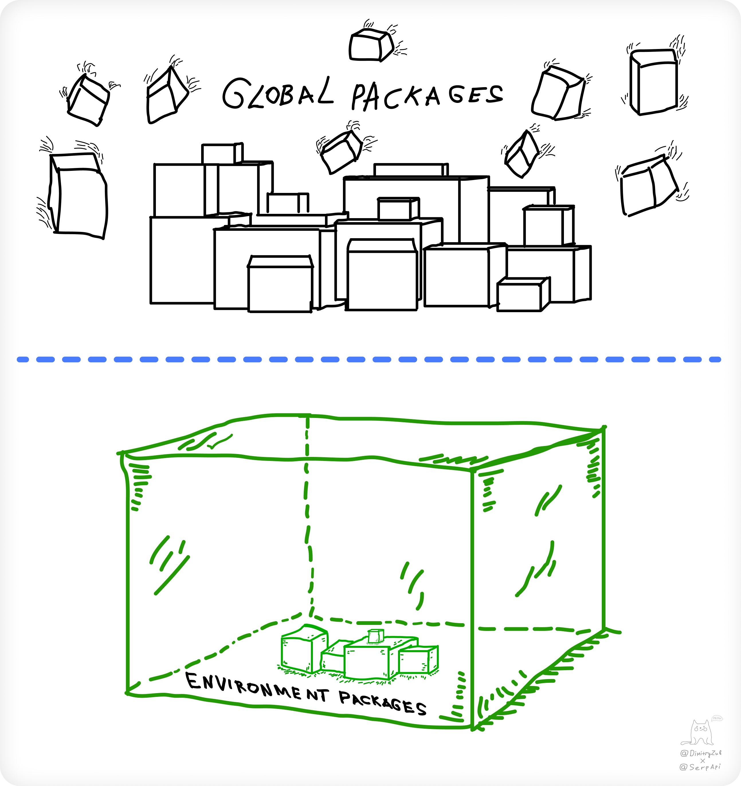
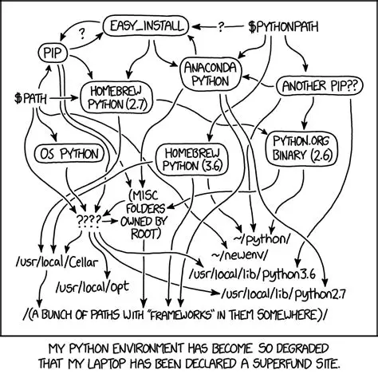
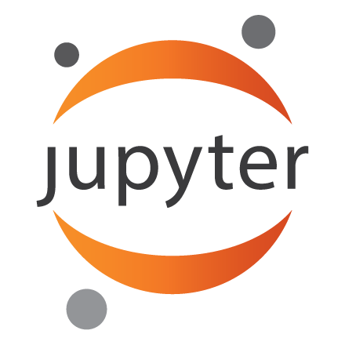
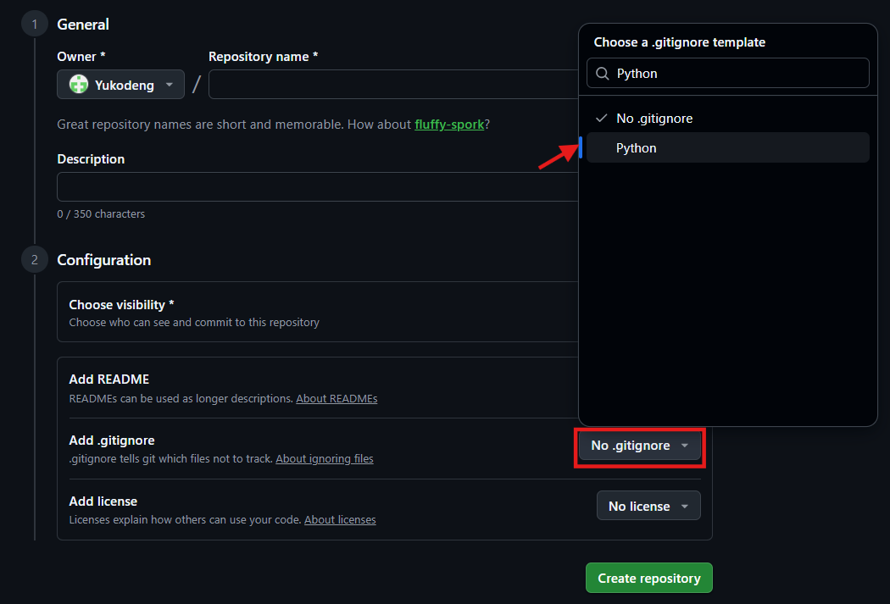
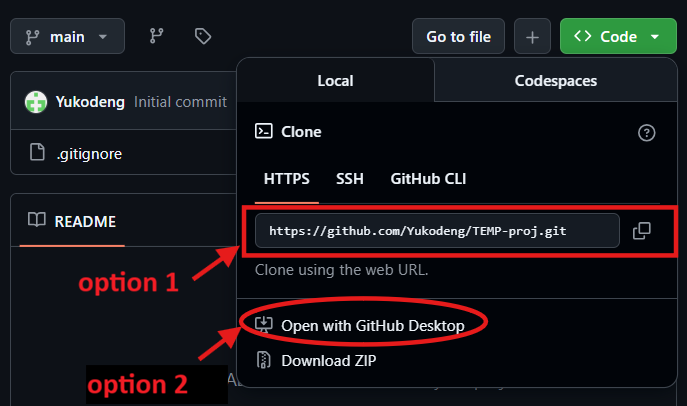
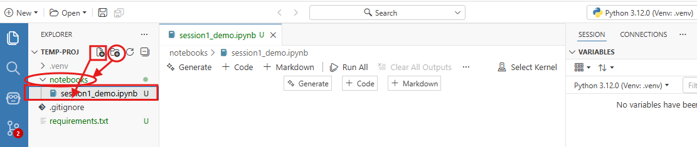
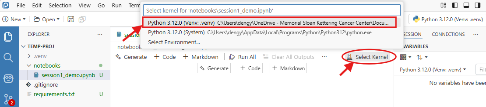
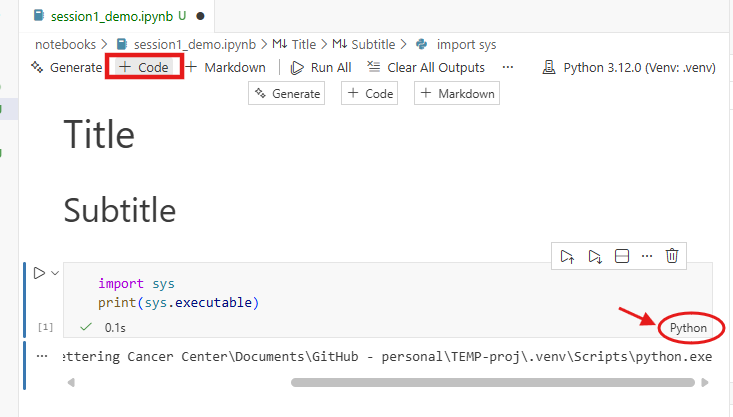
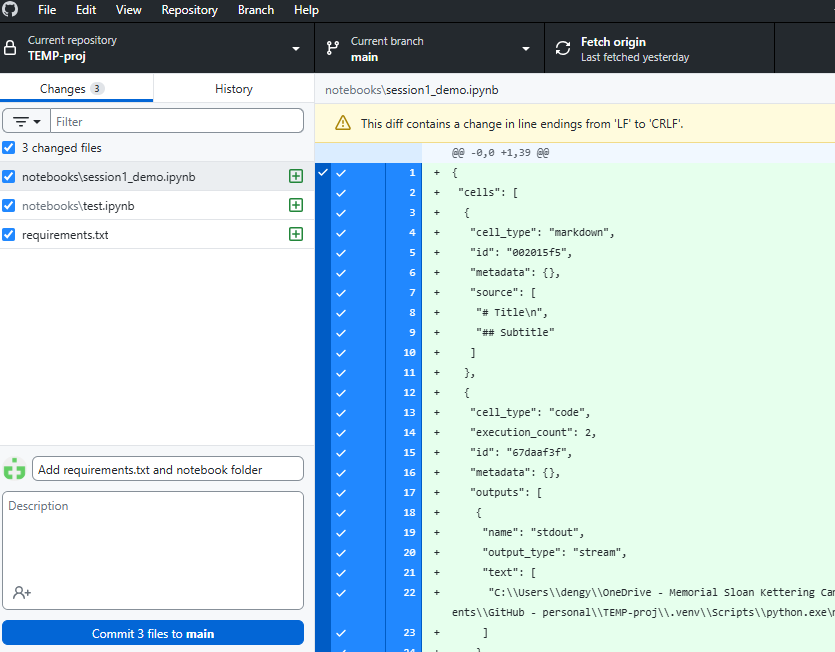
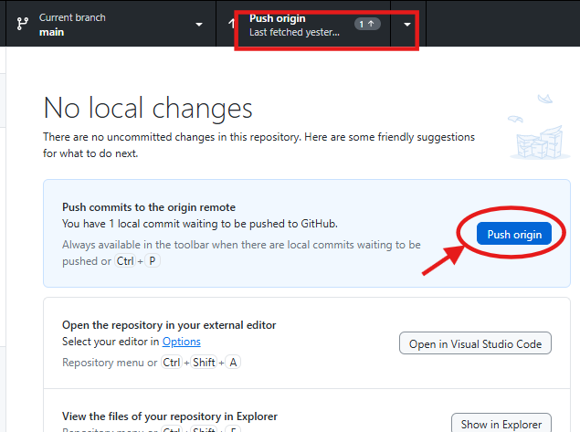

# Website

<span style="font-size: 1.2em">**Workshop website**: [https://pythonforrusers.github.io/Python-Workshop.github.io/](https://pythonforrusers.github.io/Python-Workshop.github.io/)</span><br>
   👉Find session handouts, assignments, and extra tutorials<br>
   👉Ask questions (GitHub Discussion page)<br>


# Workshop Overview

::: {.fragment .callout-tip appearance="simple"}
The **goal** of the workshop is to learn programming in Python using ***modern, reproducible*** tools that can be integrated into your own work.
:::

::: columns 

::: {.column width="33%"}
::: {.fragment}
**Session 1**

-  Python vs. R.
-  Seting up a Python programming ecosystem (`venv`, Positron IDE, GitHub, Jupyter Notebooks).
:::
:::

::: {.column width="33%"}
:::{.fragment}
**Session 2 and 3**

-  Python basics -- data structure, list comprehensive, methods vs. functions.
-  `pandas` and `great_tables` data manipulation.
:::
:::

::: {.column width="33%"}
:::{.fragment}
**Session 4**

-  Object-oriented programming (OOP).
-  Machine learning models with `scikit-learn` and `pytorch`.
-  `plotnine` and `seaborn` visualization.
:::
:::

:::


## Session 1 Learning Goals {.center}
In this session, we will familiarize with Python and essential tools for building reproducible Python projects. 
<br><br>

💡 **Python overview**: What is Python? Python vs. R?<br>
💡 **Virtual environments**: `venv` for creating reproducible virtual environments<br>
💡 Integrated development environments **Positron** and interactive code editng tool **Jupyter Notebook**<br>
💡 **Python reproducible workflow**: Integrate GitHub, virtual environments, and Positron IDE into your Python programming projects.


# Introduction to Python

## What is Python?
<br><br>

{.absolute top=0 right=70 width=380}

> Python is an **open-source, high-level, interpreted, general-purpose** programming language

:::{.incremental}
-  **Easy to use**: Python syntax is designed to be readable and user-friendly
-  **Interpreted**: run code line-by-line without compiling (unlike C/C++)
-  **General-purpose**: widely used for data science, ML/AI, software development, etc.
-  **Open-source**: free! Mass user community contributing to the package ecosystem
:::


## Python vs. R

Python and R differ in **programming philosophy**, **computational capacity**, and **extensibility**.

<table>
  <thead>
    <tr><th>**Feature / Task**</th><th>**R**</th><th>**Python**</th></tr>
  </thead>
  <tbody>
    <tr class="fragment"><td>**Scope of functionality**</td><td> Primarily for statistical and data analysis</td><td> General-purpose: ML & AI, software development, scripting, etc.</td></tr>
    <tr class="fragment"><td>**Programming style**</td><td>Function-oriented</td><td>Object-oriented</td></tr>
    <tr class="fragment"><td>**Computational power**</td><td>✅ Vectorized operations <br> ⚠️ Memory-intensive for large data and loops</td><td>✅ Faster loop performance <br> ✅ Strong GPU support <br> ✅ Efficient memory use</td></tr>
    <tr class="fragment"><td>**Package ecosystem**</td><td>✅Open source: CRAN, Bioconductor, GitHub <br> ✅ Rich ecosystem of statistical tools <br> ⚠️ Fewer ML/AI tools</td><td> ✅Open source: PyPI, GitHub <br> ☑️ Emerging statistical packages <br> ✅ Extensive ML/AI tools</td></tr>
    <tr class="fragment"><td></td><td></td><td></td></tr>
    <!-- <tr class="fragment"><td>**IDE/Computing tools**</td><td>RStudio, RMarkdown, Quarto</td><td>VS Code, JupyterLab, Jupyter Notebooks, Quarto</td></tr> -->
  </tbody>
</table>


## Python Package Ecosystem

:::{.fragment .fade-in-then-out .absolute top="200"}
### Statistical analysis & data wrangling
While R is the go-to language for statistical analysis, Python has caught up with many equivalent pacakges that offers similar functionality and styles:

-   `statsmodels` / `scipy.stats` provide **regression modeling** and **hypothesis testing**.
-   `scikit-survival` / `lifelines` support **survival analysis** and plotting.
-   `polars` (~`dplyr` data cleaning) / `great_tables` (~`gt` tables) / `plotnine` (~`ggplot2` visualizations)
:::

:::{.fragment .fade-in-then-out .absolute top="200"}
### ML/DL ecosystem 
Python dominates in machine learning and AI development:

-   `scikit-learn` is a comprehensive **machine learning** library that supports supervised regression and classification (e.g., random forests, gradient boosting) and unsupervised clustering (e.g., K-means) analyses
-   `TensorFlow` / `PyTorch` are **deep learning** libraries widely used for computer vision and natural language processing (NLP).
-   `optuna` / `Ray` can be integrated into ML/DL workflows for easy and efficient **model training, hyperparameter tuning, fine-tuning**, etc.
:::

:::{.fragment .fade-in-then-out .absolute top="200"}
### Omics data analysis 

Emerging bioinformatics packages that provide standard omics data preprocessing and analysis pipeliness:

-   `scanpy`, `anndata` are libraries for single-cell RNA-seq data loading, preprocessing, and analysis
-   `Biopython` is a set of tools for biological computation that performs file parsering, sequence analysis, clustering algorithms, etc.
-   `pysam` works with raw input files (e.g., BAM/SAM/VCF)
:::


## Get started: Essential Tools {.center}

<span style="font-size: 1.2em">Make your python project **reproducible**! </span><br>

:::{.fragment}
-   **pip**: Python package installer (comes with Python installation)
:::
:::{.fragment}
-   **Positron**: a modern IDE developed by Posit designed for Python + R
:::
:::{.fragment}
-   **Jupyter Notebook**: an interactive computing tool that combines code + markdown + visualizations + media
:::
:::{.fragment}
-   **Git/GitHub**: version control, collaboration, and code sharing
:::


## Pip {.center}

> Pip is **command line interface (CLI)** for managing Python packages. It installs packages from **Python Package Index (PyPI)** and other sources such as GitHub.

:::{.callout-note appearance="simple"}
Since Python 3.4+, pip is automatically installed for:

-  Python installations from [python.org](python.org)
-  Python virtual environments
:::

<li>**Command line**: **Install, upgrade, and uninstall** packages through `pip <command>`</li>
<li>**Virtual environments**: pip can be used within virtual environments created with `venv`</li>


## Virtual Environments {.center}

> Environments are **isolated**, **self-contained** folders with their own **Python interpreter** and set of installed **packages**.

::: columns

::: {.column}
<br><br>
<span style="font-size: 1.2em">**Example**:</span> 
   <li> **Virtual environment 1**:<br> Python 3.8 + scikit-learn 1.3.2</li>
   <li> **Virtual environment 2**:<br> Python 3.12 + scikit-learn 1.8.0 + torch</li>
<br>

<span style="color: #007acc">Creating virtual environments allows them to operate fully **independently** and not interfere with each other!</span>

:::

::: {.column}
{width="550"}
:::

:::


## Why Use Virtual Environments?

:::{.fragment .fade-in-then-out .absolute top="100"}
You may find the flexibility of environments helpful when you have multiple project with ***slightly*** different dependency requirements...

{width="700" fig-align="center"}
:::

:::{.fragment .absolute top="100"}

:::{.fragment .fade-in-then-semi-out}
-   **Avoid Conflicts.** Avoid potential conflicts between different projects' dependency requirements. Changes to one environment won't affect other projects that use different environments.
:::
:::{.fragment .fade-in-then-semi-out}
-   **Easy Management**. Less concern about breaking things. You can easily delete a virtual environment if issues occur and recreate it.
:::
:::{.fragment .fade-in-then-semi-out}
-   **Reproducibility.** Work as time capsules, allowing you to replicate the requirement of a project at later time points or on new machines.
:::
:::{.fragment .fade-in-then-semi-out}
-   **Sharing Environments**. Easily share the Python version and list of dependencies with other people through a copy of the `requirements.txt` file.
:::

:::


# Integrated Development Environment

> An **Integrated Development Environment (IDE)** is a suite of tools contained in a software application, which typically includes:

- A source code editor 
- A compiler or interpreter to execute code
- A built-in debugger
- Environment management and version control systems for development workflows

An IDE brings together everything you need to write and run code and manage projects.

<!-- ## Commonly Used IDEs for Python

| Tool        | Description                                          |
| ----------- | ---------------------------------------------------- |
| **VS Code** | Lightweight, modular, and highly extensible editor suitable for both script-based and project-oriented workflows |
| JupyterLab  | Web-based notebook interface supporting live code execution, rich text, and interactive outputs |
| Spyder      | IDE designed for scientific computing with MATLAB-like layout and support for `pandas`, `numpy`, and `matplotlib` |
| PyCharm     | Comprehensive IDE tailored for professional software development in Python, includes advanced refactoring and testing tools |
| RStudio     | Cross-language IDE primarily for R but extensible to Python, includes Quarto integration and reproducible research tools | -->

---

:::{.fragment}
<span style="font-size: 1.5em">**Positron**</span><br><br>

{.absolute top=0 right=50 width=150}

Positron is a new IDE (*released 2025*) designed for **Python + R** with many great features:

-  **Built-in Suport for Python and R.** No extra extensions & easy transition from VS Code and RStudio  
-  **RStudio-Style Layout.** Editor + Console + Plots/Variables/Help panes
-  **Multi-Session Console.** Work in multiple languages/environments seamlessly at the same time
-  **Integrated Git & Remote Connection.** Connection to GitHub + remote SSH sessions
:::

<br>

:::{.fragment}
<span style="font-size: 1.5em">**Jupyter Notebook**</span><br><br>

{.absolute top=435 right=50 width=160}

Jupyter is an interactive computing tool that lets you combine executable code, Markdown text, and visual components in one file called a notebook (`.ipynb`).
:::
<br>

:::{.fragment}

<span style="color: #007acc, font-size: 1.2em"><strong>Positron + Jupyter notebooks for Python = RStudio + RMarkdowns for R.</strong></span>

:::


# Git / GitHub

{.absolute top=10 right=220 width=200}
{.absolute top=0 right=20 width=200}
<br>
<span style="color: #007acc">**Git**</span> is a version control system that tracks **local** code changes.<br>
<span style="color: #007acc">**GitHub**</span> is a cloud-based platform built on Git for storing, sharing, and collaborating on code.

:::{.fragment}
<span style="font-size: 1.2em">**Why use Git/GitHub?**</span>

:::{.incremental}
- **Track and commit changes** to files in a repository
- **Revert or compare** previous versions when something breaks
- **Branching** allows teamwork in parallel without overwriting each other’s work
- **Backup** your research projects in a centralized location
- **Sharing** code for publication purposes 
:::
:::


# Let's Get Started!


## Create a Reproducible Python Project {.center}

:::{.incremental}
- Install Tools:
   - [Python](hhttps://pythonforrusers.github.io/Python-Workshop.github.io/session1/session1.html#follow-along-install-python) 
   - [Positron IDE](https://positron.posit.co/download.html)
   - [GitHub Desktop](https://desktop.github.com/download/) (create a [GitHub](https://github.com) account if haven't done so)
- Create a new **GitHub repository** for your project
- Open the project in **Positron IDE**
- Set up virtual environment with `venv` 
- Organize folder structure and create a **Jupyter notebook** (`.ipynb`) file
- **Commit** changes and **push** to GitHub
:::


## ▶️Install Python 

:::{.fragment .fade-in-then-out .absolute top=80}
1.  Go to the official Python download site: [python.org/downloads/](https://www.python.org/downloads/)<br>

   -  Select your computer's OS (Windows/macOS) from the **Downloads** dropdown menu.

   -  💡Recommend **Python 3.12**, the most recent stable release.

2.  Download the **64-bit installer** for your chosen Python version (*unless your Windows is 32-bit*).
:::


:::{.fragment .fade-in-then-out .absolute top=60}
3.  **Run the installer** (`.exe` for Windows / `.pkg` for macOS).

**For Windows**, when the “Install Python” window appears: 

   - ☐ *Use admin privileges* **--Optional**
   - ✅ *Add python to PATH* **--Recommended**
   - ✅ Choose "Install Now" and keep the default installation location

**For macOS:**

::: columns
::: {.column width="50%"}
   -  Click through the installer prompts.
   -  When finished, you will see the following pops up:
   -  Click on the `.command` file. This will open a temporary **Terminal** shell window. Ensure that you see `[Process completed]` before closing the window.
:::
::: {.column width="50%"}
{width="500"}
:::
:::
:::

:::{.fragment .fade-in-then-out .absolute top=60}
4.  **Check installation**. Open **Terminal** (or PowerShell / Command Prompt on Windows) and type the following command:

   - For Windows:

``` bash
python --version
pip --version
```
   -  For macOS, you might need:

``` bash
python3 --version
pip3 --version
```

✅ You should see something like `Python 3.12.10` and `pip 25.0.1`.


:::{.callout-important appearance="simple"}
If installations not found, it usually means **PATH** wasn't correctly updated or you have another Python version in PATH that interferes with the current installation.
:::

<span style="font-size: 1.2em"><strong>*Now, you can start coding in Python in the terminal!*</strong></span>

:::

---

:::{.fragment .fade-in-then-semi-out}
Try in the **Python interactive shell** by typing in the terminal:

``` bash
python    # Windows
python3.x # macOS
```
:::

:::{.fragment .fade-in-then-semi-out}
And you will see something like:

``` python
Python 3.12.10 (tags/v3.12.10:0cc8128, Apr  8 2025, 12:21:36)
Type "help", "copyright", "credits" or "license" for more information.
>>>
```
:::

:::{.fragment .fade-in-then-semi-out}
Now, you can type Python commands directly. For example, importing a package: 

``` python
>>> import statistics
>>> data = [1, 2, 3, 4, 5]
>>> statistics.mean(data) # should return the mean 3
```
:::

:::{.fragment .fade-in-then-semi-out}
Exit the interactive console with: 

``` python
>>> quit() # or exit()
```
:::


## Install Tools {.center}

💡Before proceeding, ensure you have the following:

-   **Positron**: [Download and install Positron](https://positron.posit.co/download.html)
-   **GitHub Desktop**: [Download GitHub Desktop](https://desktop.github.com/download/)
-   *(Optional) Git CLI*: [Install Git on your computer](https://git-scm.com/install/)

::: {.callout-tip appearance="simple"}
The `git` command line tool is an alternative to GitHub Desktop. If you are comfortable with commands in the terminal, `git` offers the same functionality and flexibility for managing your code versions.
:::

:::{.fragment}
<br><span style="font-size: 1.2em">⏳Take a second to install necessary tools -- ***Any questions?***</span>
:::


## Create a GitHub Repository

:::{.fragment .fade-in-then-out .absolute top=60}

::: columns
::: {.column width="65%"}
1.  Go to GitHub: [https://github.com](https://github.com). **Sign in** or **create and account** if you haven't done so.
2.  Click **"New repository"**. 
:::
::: {.column width="35%"}
{width="400"}
:::
:::

-  Type a name in the **"Repository name"** box (e.g., **`workshop-project`**)

   {width="100%"}
:::

:::{.fragment .fade-in-then-out .absolute top=60}
-  Add `README.md` (optional) and `.gitignore` (choose **Python** template)

   {width="900"}

-  Click **"Create repository"**

:::{.callout-tip appearance="simple"}
The `.gitignore` file tells Git which files/folders to ignore when making commits. **E.g.**, the environment folder (`.venv/`) that we will later create. This is a good practice to avoid pushing overly large files and/or sensitive data.
:::
:::


:::{.fragment .fade-in-then-out .absolute top=60}
3. **Clone** the repository to your local computer by clicking 
{.absolute top=5 right=250 width=150}


   {width=680 fig-align="center"}

-  **Option 1 (CLI)**: Copy the **HTTPS URL** and clone with `git` command

   ``` bash
   cd <path-to-a-parent-folder>
   git clone https://github.com/<username>/<workshop-project>.git
   ```

-  👉**Option 2 (GUI)**: Open in **GitHub Desktop**. Choose the local path you want to clone to.

   {width="680" fig-align="center"}

:::


## Create Repo Locally with `git` Commands

An alternative to the previous actions -- Using Git CLI.

:::{.fragment .fade-in-then-semi-out}
1.  Create a new project folder (e.g., `workshop-project`):

``` bash
mkdir workshop-project
```

Or navigate to an existing one:

``` bash
cd workshop-project
```
:::
:::{.fragment .fade-in-then-semi-out}
2.  Initialize a Git repository:

``` bash
git init
```
:::

:::{.fragment .fade-in-then-semi-out}
3.  Create a `.gitignore` file to avoid committing large and misc files. For example:

    ``` text
    # Environments
    .venv/

    # Python cache
    __pycache__/

    # Jupyter
    .ipynb_checkpoints/

    # macOS files
    .DS_Store
    ```
:::
:::{.fragment .fade-in-then-semi-out}
4.  Make your first commit:

    ``` bash
    git add .
    git commit -m "Initial commit"
    ```
:::

:::{.fragment}
:::{.callout-tip}
## Connect folder to GitHub
If you want to publish your project to GitHub, create a new **empty** repository on GitHub (without `.gitignore`), copy the repository URL, and run the following to connect and push changes:

``` bash
git remote add origin <YOUR_GITHUB_REPO_URL>
git branch -M main
git push -u origin main
```
:::
:::


## Open Project in Positron 

:::{.fade-in-then-out .absolute top=70}
1.  Launch **Positron**.

2.  Open your project folder:

    -  From the Welcome page:

        {width="900"}

        **Or**

    -   By selecting **File \> Open Folder** (`Ctrl+K / Ctrl+O`). 
    -   Select you folder (`<workshop-project>`)
:::


## Create a Project-Specific Environment with `venv`

:::{.callout-important appearance="simple"}
**Note**: While Positron has built-in support for Python, you still need it installed locally. Ensure you have followed the previous steps to install **python** and **pip** .
:::

:::{.incremental}
1. In your project folder, locate the **TERMINAL** panel at the bottom. 
-  If not shown. Open the **Command Palette** (`Ctrl+Shift+P` or `Cmd+Shift+P`) and type **"Python: Create Terminal"**

2. Create a virtual environment with `python -m venv <env-name>`:

-  Name it **".venv"**. Ensure you are using the right `python` command.

:::{.fragment}
```bash
python -m venv .venv  # Windows
python3 -m venv .venv # macOS
```
:::

-  **NOTE:** If your system default Python is a different version, you may need to specify the correct version with:

:::{.fragment}
``` bash
python3.x -m venv .venv # macOS/Linux
py -3.x -m venv .venv   # Windows
```
:::

-  This will create a `.venv/` folder inside the project directory.

:::{.fragment}
:::{.callout-important appearance="simple"}
## Add **.venv** to `.gitignore`
The `.venv/` folder is often large and specific to your computer. Therefore, it is generally recommended to add it to your `.gitignore` file and bypass Git tracking.<br>
💡Instead, only commit the `requirements.txt` file--which lists all dependencies for the virtual environment. 
:::
:::

3. **Activate** the venv:

:::{.fragment}
``` bash
source .venv/bin/activate   # macOS/Linux
.venv\Scripts\activate.bat  # Windows (Command Prompt)
.venv\Scripts\Activate.ps1  # Windows (PowerShell)
```
:::

-  When activated, your terminal will show:

:::{.fragment}
``` bash
(.venv)
```
:::
:::

---

::: incremental

***Other useful commands:***

   -  To deactivate the environment:

::: fragment
```bash
deactivate
```
:::

-  To remove an environment:

   💡Since a venv is just a folder, you can delete it safely, either by deleting the `.venv/` folder or removing via terminal commands:

::: fragment
``` bash
rm -rf .venv        # macOS/Linux
rmdir /s /q .venv   # Windows
```
:::
:::


##  Install Packages to Venv with `pip` and `requirements.txt`

:::{.fragment}
Pip can be used to **install, upgrade**, and **uninstall** packages from a virtual environment.<br>Some useful `pip` (or `pip3` for macOS) commands include:

``` bash
pip install <package>
pip install <package>==<version> 
pip install --upgrade <package>
pip uninstall <package>
```
:::

::: fragment
Packages can also be installed at once using a `requirements.txt` file:
:::

::: fragment
Example:

```text
pandas
numpy
matplotlib
scipy==1.14.0
```
:::
::: fragment
<span style="font-size: 0.9em">👉Download the `requirements.txt` file for this Python workshop series from GitHub repo: [https://github.com/PythonForRUsers/Python-Workshop.github.io/blob/main/Downloadable/requirements.txt](https://github.com/PythonForRUsers/Python-Workshop.github.io/blob/main/Downloadable/requirements.txt).</span> 
:::

::: fragment
Now, **install** with the following command:

``` bash
pip install -r requirements.txt # or `pip3` for macOS
```
:::

:::{.fragment}
:::{.callout-warning appearance="simple"}
## Avoid installing packages into the wrong environment!

Before running `pip install`, always confirm your environment is activated (you should see (.venv) in your terminal prompt). If forgotten, `pip install` will install into your global Python which can cause conflicts.
:::
:::

:::{.fragment}
The requirement file can also be created from an existing environment with: 

``` bash
pip freeze > requirements.txt
```
This will save an `requirements.txt` file with a snapshot of all current installed packages (and exact versions) to your project directory.
:::


## Create a Jupyter Notebook (`.ipynb`)

:::{.fragment .fade-in-then-out .absolute top=100}
First, let's **organize** the folder.<br>
Keep `requirements.txt` and `.gitignore` files in the parent directory and create separate folders for scripts, data files, etc.

-  Eample project folder structure:

```text
workshop-project/
   ├── data/            # Raw & processed data folder
   ├── notebooks/       # Jupyter notebooks for data analysis
   ├── requirements.txt  # Virtual environment txt file
   ├── .gitignore       # Files that git should not track
   └── README.md        # Project description 
```
:::

:::{.incremental}
1.  Create a `notebooks/` folder from the **Explorer** bar on the left side and create a new Jupyter Notebook file:

::: fragment
{width="900"}
:::

2.  Select the right Python **kernel**:

   -   Locate the **Select Kernel** button at the top-right of the notebook
   -   Choose the kernel associated with your project venv (e.g., `Python 3.x .venv`)

::: fragment
   {width="900"}
:::
:::
::: fragment
:::{.callout-note appearance="simple"}
If you don't see the environment showing up:

Make sure your venv has the dependencies installed:

   ``` bash
   pip install ipykernel jupyter
   ```
Then restart Positron or reload the window (`Ctrl+Shift+P` \> `Developer: Reload Window`).
:::
:::

---

### Create Code and Markdown Cells 

:::{.incremental}
-   Select `+ Code` or `+ Markdown` from the top of the notebook (or use keyboard shortcut `A` or `B`)

-  **Markdown** cells allows add **texts, headings, links, images** -- everything that is not code to execute. Some examples are:

::: fragment
```{.yaml code-line-numbers="1-3|4|5|6-7|8-9|10"} 
# Heading 1
## Heading 2
### Heading 3
Regular text
> quote
**bold text** or __bold text__
*italic text* or _italic text_
* bullet 1
* bullet 2
`in line code`
```
:::

-  This will result in:

::: fragment
{width="880"}
:::
:::

---

:::{.incremental}
-   **Code** chunks are executable. 

-  You can **import packages, assign variables**, and **execute functions** by clicking the **Run** icon to the lelft of the cell. The output will then be displayed below the code chunk.

::: fragment
{width="800"}
:::

-  Now, try run the following in a notebook cell:

   ```python
   import sys
   print(sys.executable)
   ```

-  This should return the path of the python.exe executable in your `.venv/` folder.
:::

## Commit and Push Changes to GitHub

::: fragment
1. Open **GitHub Desktop**
   -  Go to your `<workshop-project>` repository
:::

::: fragment
2. **Review changes** from the left **Changes** tab
   -  You should see:
      -  ✅`requirements.txt`
      -  ✅`notebooks\<sess1-demo>.ipynb`
      -  ❌`.venv\` ***--should be included in `.gitignore` and not be commited!***

   - ***NOTE:*** If you added `.gitignore` when creating the repo, it would be included in the previous (initial) commit.
:::

::: fragment
4. Add a **Commit** message and 
   - Add a summary message, e.g. **“Add requirements and notebook folder”**
   - Click **Commit to main**

   
:::

::: fragment
5. **Push to GitHub**. Click **Push origin**


:::


## You are all set! 👏 {.center}

You now have a Python project for the Workshop sessions with a `.gitignore` file, **Git** version control, a local project-specific **virtual environment**, and a working notebook folder inside the Positron workspace. 


# Takeaways

:::{.incremental}
-  Python is a **general-purpose**, **object-oriented** language with associated attributes and functions. This modular setup allows high extensibility of Python programs to new features.
-  Virtual environments help **isolate** Python versions and dependencies across projects and helps avoid conflicts and ensure project **reproducibility**.
-  Use Git/GitHub for **tracking changes, version control, code sharing**, and **collaboration**.
-  Positron or other IDEs to contain everything. 
:::
<br>

:::{.fragment}
<span style="color: #006acc; font-size:1.4em">**Questions?**</span> 

{width="350" fig-align="center"}
:::

# 🔥Helpful Resources

<span style="font-size: 1.2em"> **Books / Websites**: </span><br><br>
   ***[Python for Data Analysis, 3ed](https://wesmckinney.com/book/)*** by Wes McKinney (one of the creators of `pandas`!)<br>
   **[Git and GitHub learning resources](https://docs.github.com/en/get-started/start-your-journey/git-and-github-learning-resources#using-git)** by GitHub Docs with links to free online courses and tutorials.<br>
   **[Official Positron Guide](https://positron.posit.co/welcome.html)** by Posit PBC.<br>
   ***[Your first Python project in Positron](https://posit.co/blog/first-python-project-in-positron/).*** for creating new projects and virtual environments using the Positron GUI.<br>
   [***Python Rgonomics***](https://emilyriederer.netlify.app/post/py-rgo-2025/) by Emily Riederer -- Python counterparts of R packages (*we will cover some like `great_tables` and `plotnine` in later sessions. Stay tuned!*)


# Thank you!