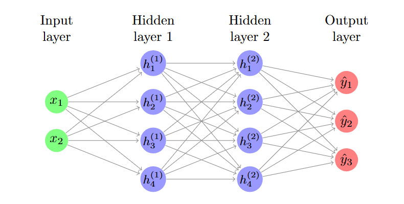

This pre-read contains information on the models we'll be using for the in-class examples on classifying penguin species. This information will not be covered during the class, so it is here for your reference.

## Neural Network Classifier vs KMeans: Supervised vs Unsupervised Learning

We will be using PyTorch for the Neural Network and Scikit-learn for the KMeans clustering.

### Neural Network Classifiers

A **neural network classifier** is a type of **supervised learning model** that learns to assign input examples to classes (like penguin species) by finding patterns in labeled training data.

{width=80% fig-alt="Neural network diagram"}

* Neural networks are inspired by biological brains: they consist of connected units called nodes (or sometimes 'neurons') organized in layers. Each node processes inputs and passes an output to the next layer. 
* A simple network has an **input layer** (input features), one or more **hidden layers** (which transform and combine features), and an **output layer** (which produces scores for each class). 
* Each connection between node has a **weight** that the network learns during training. The network uses these weights to decide how strongly to respond to different inputs.

Training a neural network involves:

* Feeding the training data through the network (the **forward pass**),
* Comparing the predictions to the true labels using a **loss function**,
* Adjusting the weights to reduce the loss using techniques like **backpropagation** and gradient-based optimization.

A neural network classifier learns a function that maps input features to output classes. Once trained, you give it a new example and it predicts the most likely class for that example using learned representations from many training examples.

> Example: Given a penguin’s bill length and bill depth, a trained neural network will produce a set of output scores for each species and select the species with the highest score as its prediction.

<details><summary> Click for more information on neural network classifiers! </summary>

  <i> mouse over <span class="tooltip-term"> underlined <span class="tooltip-text"> tooltip! </span></span> text for more information.</i>

  <h2>What Happens Inside a Neural Network</h2>

  To understand the `PenguinNet` model, it helps to know what actually happens inside each layer of a neural network.

  <h3>The Basic Computation</h3>

  Each node (neuron) in a neural network performs a simple mathematical operation:

  1. **Multiply inputs by weights**
  2. **Add a bias**
  3. **Apply an activation function**

  Mathematically this looks like:


  $z = w_1x_1 + w_2x_2 + ... + w_nx_n + b$

  $a = g(z)$

  Where:

  * (x) = input features
  * (w) = learned weights
  * (b) = bias term
  * (g) = activation function
  * (a) = neuron output

  The **weights** determine how strongly each input affects the neuron, and they are learned during training. The **bias** allows the model to shift the <span class="tooltip-term">
decision boundary
<span class="tooltip-text">
a line or surface representing where a model changes its predicted class
</span>
</span> so it can better fit the data. 

  The output from one layer becomes the input to the next layer. This process continues until the network produces class predictions for the input data. 

  ---

  <h3> Activation Functions </h3>

  After computing the weighted sum of inputs, neural networks apply an <span class="tooltip-term"> **activation function** <span class="tooltip-text"> The activation function is applied to the weighted sum of inputs. </span></span>

  Activation functions introduce **non-linearity** into the model. Without them, the network would behave like a simple linear model, no matter how many layers it had. 

  One of the most common activation functions is **ReLU (Rectified Linear Unit)**:


  $\text{ReLU}(x) = \max(0, x)$

  This means:

  * negative values become **0**
  * positive values remain unchanged

  ReLU is popular because it is simple, efficient, and works well in deep neural networks.

  Other activation functions you might see include:

  * **Sigmoid** – outputs values between 0 and 1 (often used for binary classification)
  * **Tanh** – outputs values between −1 and 1
  * **Softmax** – converts output scores into probabilities for multi-class classification

  ---

  <h2> Layers in a Neural Network </h2>

  A typical neural network contains three types of layers:

  **Input layer**

  * Receives the input features from the dataset
  * In the penguin example: bill length and bill depth

  **Hidden layers**

  * Transform and combine features
  * Each layer learns increasingly complex patterns in the data

  **Output layer**

  * Produces scores for each class
  * For a 3-species penguin classifier, there are 3 output neurons

  ---

  <h3> How This Relates to the PyTorch Model </h3>

  The model below defines a small **feedforward neural network** using PyTorch.

  ```python
  class PenguinNet(nn.Module):
      def __init__(self, hidden_units=16, n_classes=3):
          super().__init__()
          self.network = nn.Sequential(
              nn.Linear(2, hidden_units),
              nn.ReLU(),
              nn.Linear(hidden_units, hidden_units),
              nn.ReLU(),
              nn.Linear(hidden_units, n_classes)
          )

      def forward(self, x):
          return self.network(x)
  ```

  <h3>`nn.Module`</h3>

  All neural network models in PyTorch inherit from `nn.Module`.
  This provides the infrastructure for storing parameters, tracking gradients, and running training.

  ---

  <h3>`nn.Sequential`</h3>

  `nn.Sequential` creates a **pipeline of layers** that are applied in order.

  The data flows through them like this:

  ```
  input → Linear → ReLU → Linear → ReLU → Linear → output
  ```

  ---

  <h3>Linear Layers</h3>

  `nn.Linear(in_features, out_features)` represents a **fully connected layer**.

  It performs the operation:


  $Wx + b$


  where:

  * `W` = weight matrix
  * `b` = bias vector

  For example:

  ```python
  nn.Linear(2, hidden_units)
  ```

  means:

  * 2 input features
  * `hidden_units` neurons in the next layer

  Each neuron learns its own weights and bias.

  ---

  <h3>Hidden Layers</h3>

  Your network has **two hidden layers**:

  ```
  2 inputs → 16 neurons → 16 neurons → 3 outputs
  ```

  These layers allow the model to learn complex feature combinations.

  For example:

  * bill length + bill depth interactions
  * nonlinear boundaries between species

  ---

  <h3>Output Layer</h3>

  The final layer

  ```python
  nn.Linear(hidden_units, n_classes)
  ```

  produces **three scores**, one for each penguin species.

  These values are called **logits** (unnormalized scores).
  During training they are typically passed into a loss function like:

  ```
  nn.CrossEntropyLoss()
  ```

  which internally applies **softmax** to convert the scores into class probabilities.

  ---

  <h3>The Forward Pass</h3>

  The `forward()` method defines how data flows through the network.

  ```python
  def forward(self, x):
      return self.network(x)
  ```

  When the model is called:

  ```python
  model(x)
  ```

  PyTorch automatically runs:

  ```
  input → forward() → prediction
  ```

  This is the **forward pass**, where the network computes predictions layer by layer. 

  ---

  <h3>Training the Network</h3>

  During <span class="tooltip-term"> training <span class="tooltip-text"> Occurs during the `fit()` method in our Classifier example. </span></span>, the process looks like this:

  1. **Forward pass**
    Input features move through the network to produce predictions.

  2. **Loss calculation**
    The model compares predictions with the true labels.

  3. **Backpropagation**
    Gradients are computed to determine how weights should change.

  4. **Optimization step**
    An optimizer (like Adam or SGD) updates the weights to reduce the loss.

  Over many training iterations, the model learns weights that correctly separate the classes.

  ---

  <h3>Summary</h3>

  Your `PenguinNet` model is a **small multilayer perceptron (MLP)** classifier:

  * **2 input features** (bill length, bill depth)
  * **2 hidden layers** with ReLU activations
  * **3 output neurons** (one for each species)

  The linear layers learn weighted combinations of features, and the activation functions allow the network to model complex nonlinear relationships in the data.


</details>
---

### K-Means Clustering

**K-Means** is an **unsupervised** learning algorithm used for **clustering**:

- You do **not** provide the true labels.
- The algorithm tries to split your data into **k groups** based on similarity.
- It randomly initializes cluster centers, assigns points to the nearest one, then updates the centers iteratively.

> Example: Given penguin data without species labels, group them into 3 clusters based on bill length and depth.

---

## Plotting in Python 

Please read the 'Parts of a Figure' and 'Coding Styles' sections of [Quick Start Guide (Matplotlib)](https://matplotlib.org/stable/users/explain/quick_start.html). We will briefly cover plotting with `Seaborn` (which is built on top of the `Matplotlib` package), but will not spend much time talking about base `Matplotlib`.

# Optional Reading

### Introduction to Object-Oriented Programming (OOP) in Python 

We will cover the basics of object-oriented programming and how it relates to analysis workflows in Python during session 4, but [Introduction to OOP in Python (Real Python)](https://realpython.com/python3-object-oriented-programming/) explains in greater detail and includes some practice exercises.  


#### Other plotting resources
- [Seaborn Reference](https://seaborn.pydata.org/tutorial/introduction.html#)  
- [Plotnine Reference](https://plotnine.org/reference/) 
- [Axis vs Pyplot Interface (Matplotlib)](https://matplotlib.org/stable/users/explain/figure/api_interfaces.html#the-explicit-axes-interface) 